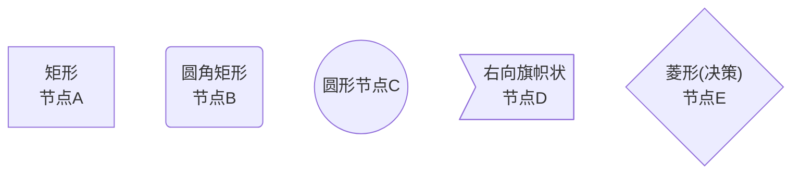
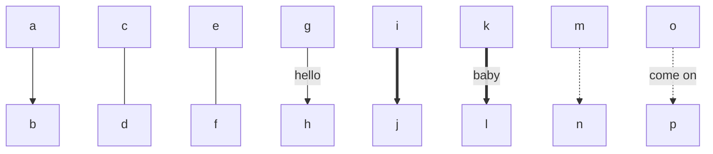
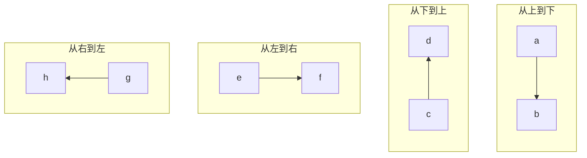
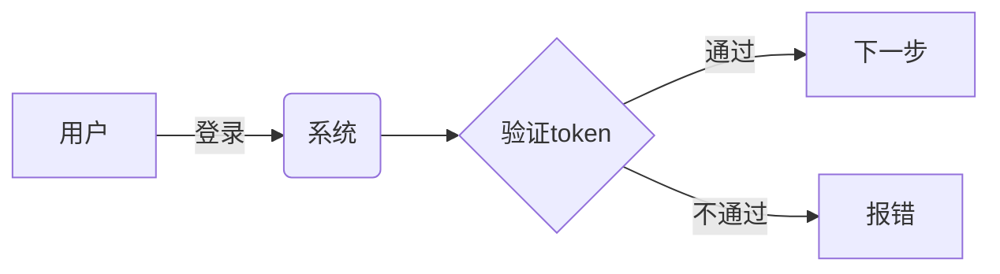
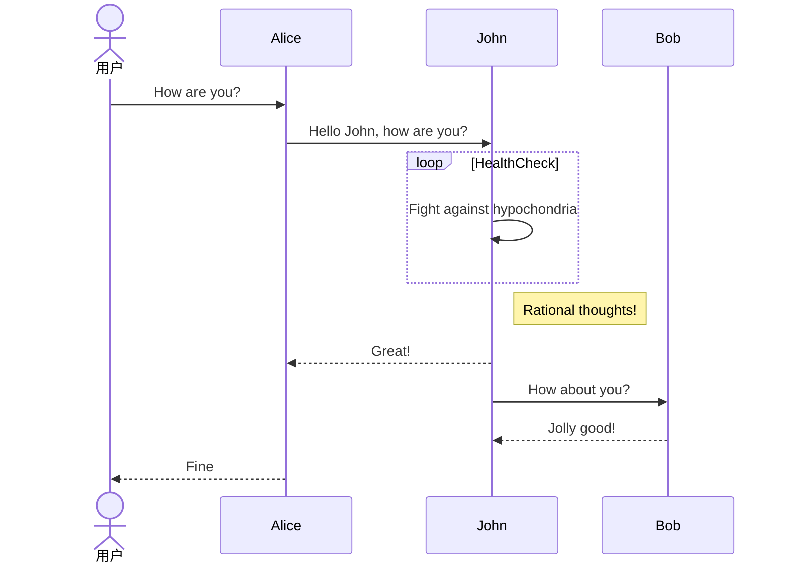
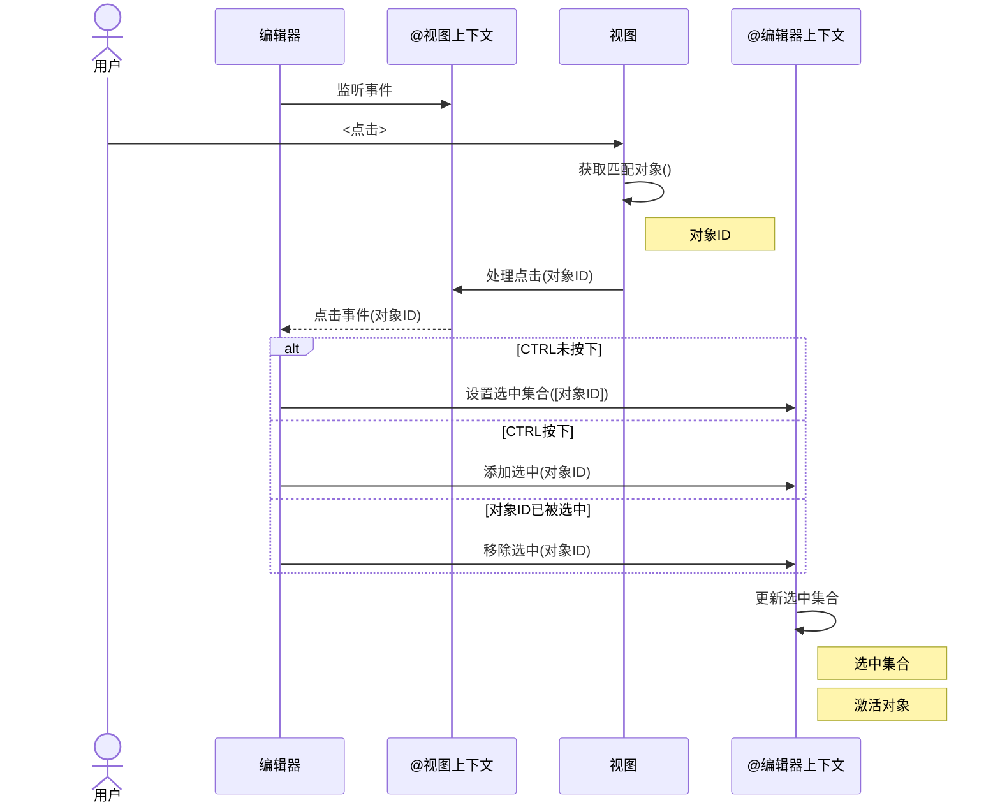
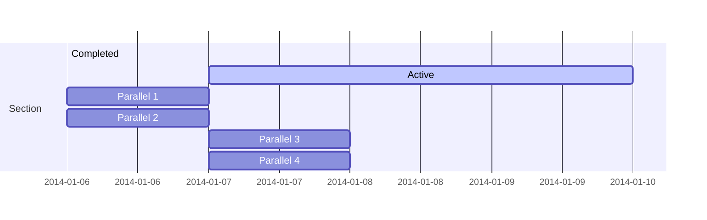
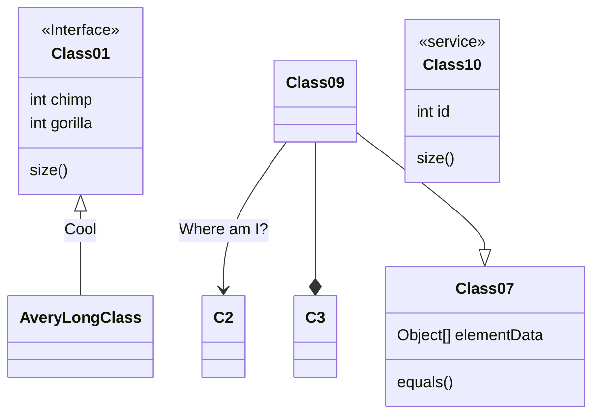
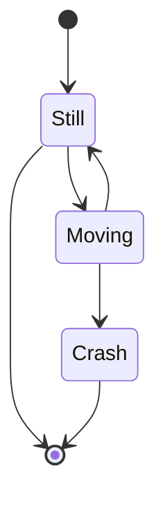
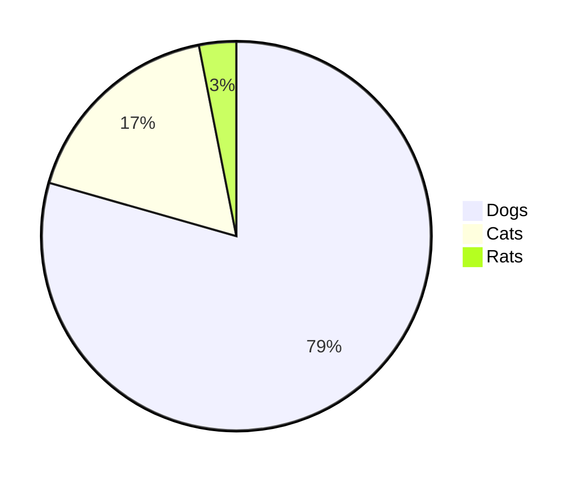

# Mermaid学习笔记
Mermaid是一个基于 Javascript 的图表绘制工具

## 图表

### 节点
#### 定义：

| 表述 | 说明 |
| --- | --- |
| node[文字] | 矩形节点 |
| node(文字) | 圆角矩形节点 |
| node((文字)) | 圆形节点 |
| node>文字] | 右向旗帜状节点 |
| node{文字} | 菱形（做决定）节点 |

#### 举例

### 节点连线
#### 说明

| 表述 | 说明 |
| --- | --- |
| ">" | 添加尾部箭头 |
| "-" | 不添加尾部箭头 |
| "--" | 单线(注意，这里是两个短横线) |
| "--text--" | 单线上加文字 |
| "==" | 粗线 |
| "==text==" | 粗线加文字 |
| "-.-" | 虚线 |
| "-.text.-" | 虚线加文字 |

#### 举例

### 图表方向
#### 定义:

| 用词 | 含义 |
| --- | --- |
| TB\|TD| 从上到下| 
| BT| 从下到上| 
| LR| 从左到右| 
| RL| 从右到左| 

#### 举例:

### 流程图

### 时序图

### 甘特图

### 类图

### 状态图

### 饼图

## 其他
- 官网地址: [https://mermaid.js.org/](https://mermaid.js.org/){:target="_blank"}
- github地址：[https://github.com/mermaid-js/mermaid/blob/develop/README.zh-CN.md](https://github.com/mermaid-js/mermaid/blob/develop/README.zh-CN.md){:target="_blank"}